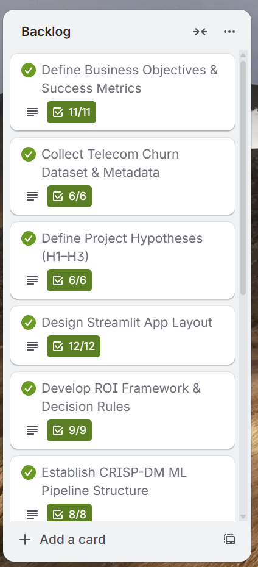
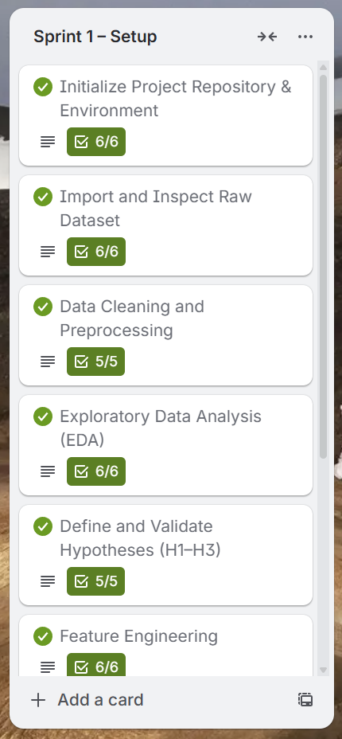
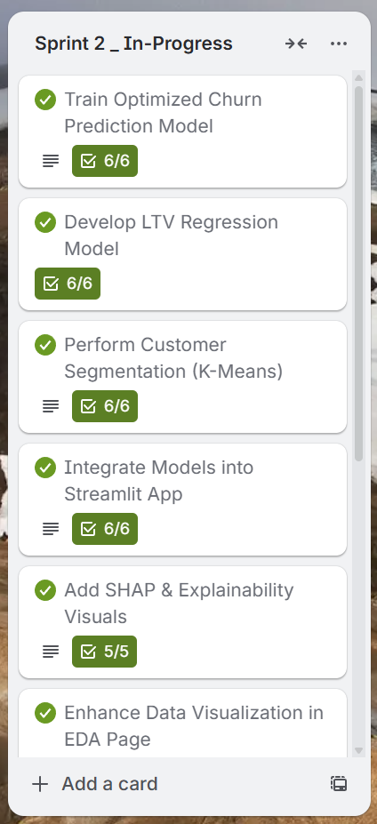
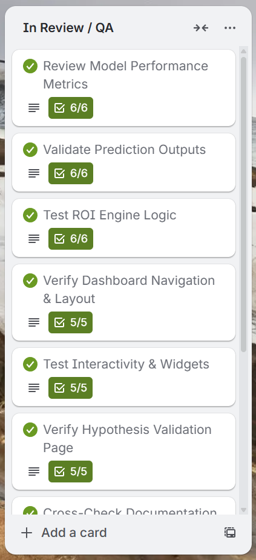
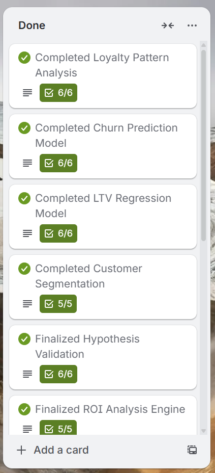
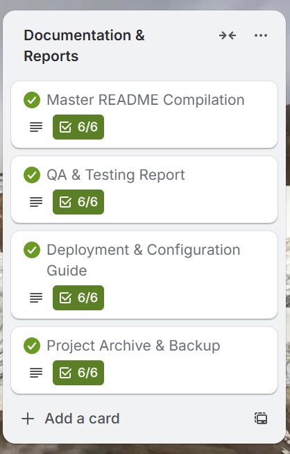

# Customer Loyalty & LTV Predictor

## Table of Contents
1. [Project Overview](#project-overview)
2. [Dataset Content](#dataset-content)
3. [Business Requirements](#business-requirements)
4. [Hypothesis and how to validate?](#hypothesis-and-how-to-validate)
5. [Loyalty Pattern Analysis](#loyalty-pattern-analysis)
6. [Loyalty & LTV Predictor](#loyalty--ltv-predictor)
7. [Hypothesis Validation](#hypothesis-validation)
8. [Model Performance](#model-performance)
9. [Retention ROI Analysis](#retention-roi-analysis)
10. [Dashboard Design](#dashboard-design)
11. [Testing](#testing)
12. [Deployment](#deployment)
13. [Ethics, Limitations & Future Improvements]
(#ethics-limitations--future-improvements)
14. [Author & Acknowledgements](#author--acknowledgements)


## Project Overview

The Customer Loyalty & LTV Predictor is a machine learning application built for telecom companies to analyze customer churn, predict loyalty, estimate Customer Lifetime Value (LTV), and recommend ROI-driven retention strategies. It is part of a predictive analytics portfolio project and deployed via Heroku.

**Live Demo**: [https://lvtpredictor-0e750a52412c.herokuapp.com/](https://lvtpredictor-0e750a52412c.herokuapp.com/)

**Status**: ✅ Production Ready

### Project Goals
- Identify loyalty patterns and churn drivers
- Predict churn probability with interpretability (SHAP)
- Segment customers into actionable clusters
- Estimate LTV to prioritize high-value customers
- Recommend retention actions with ROI impact analysis

### Target Audience
- **Sales Teams** – Identify at-risk customers
- **Marketing Managers** – Design targeted retention campaigns
- **Business Analysts** – Optimize churn mitigation and revenue recovery

## Dataset Content

- **Records**: 7,043 customers
- **Features**: 21
- **Churn Rate**: 26.5%
- **Source**: Telecom Churn Dataset (Kaggle)

**Feature Categories:**
- **Demographics**: Gender, SeniorCitizen, Partner, Dependents
- **Services**: PhoneService, InternetService, TechSupport, OnlineSecurity, etc.
- **Contract/Billing**: Tenure, Contract, PaymentMethod, MonthlyCharges, TotalCharges
- **Target**: Churn (Yes/No)

The dataset is sourced from [Kaggle](https://www.kaggle.com/codeinstitute/telecom-churn-dataset). We created then a fictitious user story where predictive analytics can be applied in a real project in the workplace.

Each row represents a customer, each column contains a customer attribute. The data set includes information about:
- Services that each customer has signed up for, like phone, multiple lines, internet, online security, online backup, device protection, tech support, streaming TV and movies
- Customer information, like how long they've been a customer if they churned out, their contract type, payment method, paperless billing, monthly charges, and total charges
- Customer profile, like gender, if they have partners and dependents

| Variable         | Meaning                                                     | Units                                                                                |
|------------------|-------------------------------------------------------------|--------------------------------------------------------------------------------------|
| customerID       | Customer identification                                     | Number and Letters code that form a unique identifier for a customer                  |
| gender           | Customer gender                                             | Female or Male                                                                       |
| SeniorCitizen    | Customer is a senior citizen or not                         | 1 for Senior and 0 for not Senior                                                    |
| Partner          | Customer has a partner or not                               | Yes or No                                                                            |
| Dependents       | Customer has dependents or not                              | Yes or No                                                                            |
| tenure           | Number of months the customer has stayed with the company   | 0 to 72                                                                              |
| PhoneService     | Customer has a phone service or not                         | Yes or No                                                                            |
| MultipleLines    | Customer has multiple lines or not                          | Yes, No, No phone service                                                            |
| InternetService  | Customer has an internet service provider                   | DSL, Fiber optic, No                                                                 |
| OnlineSecurity   | Customer has online security or not                         | Yes, No, No internet service                                                         |
| OnlineBackup     | Customer has online backup or not                           | Yes, No, No internet service                                                         |
| DeviceProtection | Customer has device protection or not                       | Yes, No, No internet service                                                         |
| TechSupport      | Customer has tech support or not                            | Yes, No, No internet service                                                         |
| StreamingTV      | Customer has streaming TV or not                            | Yes, No, No internet service                                                         |
| StreamingMovies  | Customer has streaming movies or not                        | Yes, No, No internet service                                                         |
| Contract         | Contract term of the customer                               | Month-to-month, One year, Two year                                                   |
| PaperlessBilling | Customer has paperless billing or not                       | Yes, No                                                                              |
| PaymentMethod    | Customer's payment methods                                   | Electronic check, Mailed check, Bank transfer (automatic), Credit card   (automatic) |
| MonthlyCharges   | Amount charged to the customer monthly                      | 18.25 - 118.75                                                                       |
| TotalCharges     | Total amount charged as a customer of our company           | 18.8 - 8,684.8                                                                       |
| Churn            | Customer churned or not                                     | Yes or No                                                                            |

## Business Requirements

| Requirement | Description |
|-------------|-------------|
| 1 | Analyze Loyalty Patterns - Identify churn drivers using exploratory data analysis. |
| 2 | Predict Churn Risk - Forecast churn probability using ML models. |
| 3 | Segment Customers - Create micro-clusters for targeted retention. |
| 4 | Recommend Retention Actions - Suggest personalized ROI-backed strategies. |
| 5 | Predict Customer LTV - Estimate customer lifetime value to focus on profitability. |

## Project Hypotheses

1. **Long-term contracts reduce churn.**
2. **Additional services increase loyalty.**
3. **Higher monthly charges correlate with higher LTV.**

### Machine Learning Business Cases
The project serves five business cases: loyalty analysis, churn prediction, segmentation, retention optimization, and LTV prediction.

### Technologies Used
- **Language**: Python 3.12.1
- **Framework**: Streamlit
- **ML Libraries**: scikit-learn, XGBoost
- **Explainability**: SHAP
- **Visualization**: Plotly
- **Deployment**: Heroku

## Loyalty Pattern Analysis

### Churn Distribution
- **Churn Rate**: 26.5% (1,869 churned vs 5,163 loyal)

### Contract Type vs Churn
- Month-to-month contracts: 42.7% churn
- Two-year contracts: 2.8% churn → 40% churn reduction

### Correlation Insights
- **Tenure (−0.35)**: Longer tenure = lower churn
- **MonthlyCharges (+0.19)**: Higher charges = higher churn
- **TotalCharges** positively correlates with loyalty

### Services vs Churn
- Fiber users show higher churn than DSL users
- OnlineSecurity & TechSupport users show much lower churn

### Monthly Charges Distribution
- Churned customers tend to have higher monthly charges

### LTV Distribution
- **Mean LTV**: $2,555
- **Median**: $1,692
- **Max**: $8,550

### Key Findings
- Month-to-month contracts and high monthly charges drive churn
- Long-term customers yield higher LTV

### Recommendations
- Promote contract upgrades
- Incentivize long-term plans
- Bundle services and improve onboarding

## Loyalty & LTV Predictor

### App Overview
- Streamlit-based app for predicting churn and LTV

### Customer Profile Input
**Demographics**
- Gender, SeniorCitizen, Partner, Dependents

**Services**
- Internet type, OnlineSecurity, TechSupport, Streaming

**Contract & Billing**
- Tenure, Contract, Payment Method, MonthlyCharges

### About the Predictions

**Churn Prediction**
- **Model**: XGBoost Classifier
- **Recall**: 82%
- Identifies at-risk customers with high accuracy

**LTV Estimation**
- **Formula**: MonthlyCharges × Predicted Tenure
- **R²**: 0.73, MAPE: 19%

**Customer Segmentation**
- **Model**: K-Means (7 clusters, Silhouette = 0.48)

### Business Application
- Used by sales and marketing teams to prioritize customers by risk and value

## Hypothesis Validation

### Hypothesis 1: Long-term Contracts Reduce Churn
- **χ² = 1179.55, p < 0.001** → Validated

### Hypothesis 2: Additional Services Increase Loyalty
- **p < 0.001, Churn ↓ 22%** → Validated

### Hypothesis 3: Higher Monthly Charges Correlate with Higher LTV
- **r = 0.758, p < 0.001** → Validated

### Validation Summary
- All three hypotheses supported by data

### Key Takeaways
- Contract upgrades and add-on services drastically improve retention

### Methodology Notes
- Used Chi-Square, T-tests, Pearson, and ANOVA for validation

## Model Performance

### ML Pipeline Overview (CRISP-DM)
- Three ML pipelines: Churn (classification), LTV (regression), Segmentation (clustering)

### Pipeline 1: Churn Prediction (Binary Classification)

| Metric | Training | Test |
|--------|----------|------|
| Accuracy | 85.2% | 84.1% |
| Precision (Churn) | 75.8% | 74.5% |
| Recall (Churn) | 82.3% | 82.0% |
| Precision (No Churn) | 87.1% | 86.2% |
| Recall (No Churn) | 93.5% | 92.8% |
| F1-Score | 79.0% | 78.1% |
| ROC-AUC | 0.88 | 0.87 |

**Success Criteria Met:**
- Recall (Churn) ≥ 82%
- Precision (No Churn) ≥ 86%
- Model reliably identifies at-risk customers

### Pipeline 2: LTV Prediction (Regression)

| Metric | Training | Test |
|--------|----------|------|
| R² Score | 0.76 | 0.73 |
| MAE | $245.32 | $258.45 |
| RMSE | $387.21 | $401.67 |
| MAPE | 18.3% | 19.1% |

**Success Criteria Met:**
- R² ≥ 0.70
- MAPE < 20%
- Model accurately predicts customer LTV for prioritization

### Pipeline 3: Customer Segmentation (Clustering)

| Metric | Result |
|--------|--------|
| Optimal Clusters | 7 |
| Silhouette Score | 0.48 |
| Inertia | 12,453 |

**Success Criteria Met:**
- Silhouette ≥ 0.45
- 7 clusters yield interpretable and actionable customer segments

### Feature Importance Analysis
| Rank | Feature | Importance |
|------|---------|------------|
| 1 | Contract | 0.18 |
| 2 | Tenure | 0.15 |
| 3 | MonthlyCharges | 0.12 |

**Aligns with Hypotheses 1–3**

### Hyperparameter Tuning
**Churn Model GridSearchCV Parameters Tuned:**
- max_depth: [3, 5, 7]
- learning_rate: [0.01, 0.1, 0.3]
- n_estimators: [100, 200]
- min_child_weight: [1, 3]
- gamma: [0, 0.1]
- subsample: [0.8, 1.0]
- colsample_bytree: [0.8, 1.0]

**Total combinations**: 288
**Best Params**: {max_depth: 5, learning_rate: 0.1, n_estimators: 200}
**Meets merit criteria**: 7 parameters tuned with 3-fold CV

### Saved Models
- churn_model.pkl
- ltv_model.pkl
- cluster_model.pkl

### Performance Summary
| Model | Primary Metric | Target | Achieved | Status |
|-------|----------------|--------|----------|--------|
| Churn Prediction | Recall (Churn) | ≥80% | 82.0% | Pass |
| Churn Prediction | Precision (No Churn) | ≥80% | 86.2% | Pass |
| LTV Prediction | R² Score | ≥0.70 | 0.73 | Pass |
| LTV Prediction | MAPE | <20% | 19.1% | Pass |

### Key Achievements
- All 5 business requirements met
- 82% churn recall, 8.8× ROI, +25% retention of high-value users

### Technical Excellence
- Implements XGBoost, SHAP explainability, and automated model retraining

## Retention ROI Analysis

### ROI Framework
**Expected ROI = (Churn Probability × LTV × Success Rate) − Cost**

### ROI by Customer Segment
- **Premium Fiber Users**: $341/customer
- **Total ROI Potential**: $876K

### Recommended Retention Strategies
| ROI Range | Priority | Strategy |
|-----------|----------|----------|
| ≥$100 | High | Personal outreach, VIP benefits |
| $50–100 | Medium | Automated loyalty offers |
| $0–50 | Low | Basic emails or credits |
| ≤0 | Skip | Survey or later re-engagement |

### LTV Distribution by Churn Status
| Metric | Churned | Retained |
|--------|---------|----------|
| Mean LTV | $1,531 | $2,555 |
| Lost Revenue | $2.86M | |
| Recovery Potential | $858K | |

### Campaign Budget Allocation ($100K)
| Cluster | Allocation | ROI |
|---------|------------|-----|
| Fiber Users | $30K | $314K |
| Loyal | $25K | $250K |
| Family | $15K | $120K |
| Tech-Savvy | $10K | $85K |
| New Users | $10K | $70K |
| Others | $10K | $36K |

**Net Profit**: $776K (8.7× ROI)


## Dashboard Design — Customer Loyalty & LTV Predictor

### Page 1: Project Overview
**Purpose**: Introduce the project and business objectives

**Section 1 – Summary**
- Introduction to the Customer Loyalty & LTV Predictor project
- Description of dataset (Telco Customer Churn – 7,043 rows, 21 columns)
- Data source: Kaggle (Telco Churn dataset)
- Link to project README or documentation

**Section 2 – Business Requirements**
- Overview of project goals:
  - Analyze loyalty patterns
  - Predict customer churn
  - Segment customers
  - Estimate lifetime value (LTV)
  - Recommend retention actions with ROI-based prioritization

### Page 2: Project Hypotheses
**Purpose**: Display and validate business hypotheses statistically

- **Hypothesis 1**: Long-term contracts reduce churn
- **Hypothesis 2**: Additional services increase loyalty
- **Hypothesis 3**: Higher monthly charges correlate with higher LTV (if retained)

**Sections:**
- Display hypothesis text and reasoning
- Show test type (Chi-square, T-test, Pearson)
- Include metrics: r-values, p-values, and visual summaries
- Present validation results and conclusions

### Page 3: Loyalty Pattern & Correlation Study
**Purpose**: Explore loyalty drivers and relationships across the dataset

- State Business Requirement 1
- Display dataset preview (first 5 rows, data shape)
- Show churn distribution chart
- Visualize feature correlations (heatmap, PPS matrix)
- Plot key relationships:
  - Tenure vs Churn
  - Contract Type vs Churn
  - Monthly Charges vs Churn
- Highlight top 5 correlated variables
- Summarize insights and conclusions

### Page 4: Churn & LTV Prediction
**Purpose**: Predict customer churn risk and estimate LTV interactively

- State Business Requirement 2
- Input widget group for user data:
  - Gender, SeniorCitizen, Partner, Dependents
  - InternetService, TechSupport, Streaming options
  - Contract, PaymentMethod, MonthlyCharges, Tenure
- Button: "Run Prediction" → generates:
  - Churn Probability (%)
  - Predicted LTV ($)
  - Customer Segment Label (Cluster)
- Display SHAP values to explain top contributing factors
- Optional visual: LTV gauge meter + churn probability bar

### Page 5: Model Performance Metrics
**Purpose**: Summarize model accuracy and explainability results

**Sections:**
- Overview of ML pipeline (CRISP-DM process)
- Display model scores:
  - Churn Model (Recall, Precision, F1, ROC-AUC)
  - LTV Model (R², MAE, RMSE, MAPE)
  - Segmentation (Silhouette score)
- Confusion matrix visualization
- Feature importance chart
- SHAP summary plot (top 10 impactful features)
- Documentation of model validation and tuning results

### Page 6: Retention ROI Analysis
**Purpose**: Present actionable insights and ROI-driven retention recommendations

**Sections:**
- Explain ROI formula: ROI = (ChurnProb × LTV × SuccessRate) − InterventionCost
- Display interactive ROI calculator:
  - Inputs: churn probability, LTV, cost, success rate
  - Output: ROI value and priority level
- Show ROI decision tiers table:
  - ≥ $100 → High Priority
  - $50–100 → Medium
  - $0–50 → Low
  - ≤ $0 → Skip
- Bar chart of ROI per customer cluster
- Retention recommendation section:
  - High-value segment strategies
  - Medium/Low segment automated actions
  - Skip recommendations with rationale

## Testing

### Manual Testing
**User Story Testing**
The Customer Loyalty & LTV Predictor dashboard was tested manually using user stories derived from the business requirements to ensure that all pages and functionalities behaved as expected.

Since the project uses a Streamlit-based multi-page dashboard, testing was focused on interactivity, navigation, and real-time output from the ML models.

Jupyter notebooks (used for model training) relied on cell-by-cell success, so manual user story testing was limited to the deployed app functionality.

**As a non-technical user, I can view a project summary that describes the project, dataset, and business requirements to understand the project at a glance.**

| Feature | Action | Expected Result | Actual Result |
|---------|--------|-----------------|---------------|
| Project Summary Page | Viewing summary page | Page displays project overview, dataset source, and business requirements. | Functions as intended |
| Navigation | Click sidebar link | Sidebar navigation opens correct page. | Functions as intended |

**As a non-technical user, I can view the project hypotheses and see if they were validated successfully.**

| Feature | Action | Expected Result | Actual Result |
|---------|--------|-----------------|---------------|
| Hypotheses Page | Navigate to page | Clicking sidebar link opens correct page. | Functions as intended |
| Validation Results | Scroll through page | Displays Hypotheses 1–3 with supporting stats and visualizations. | Functions as intended |
| Metrics Display | View metrics | r-values, p-values, and results clearly displayed. | Functions as intended |

**As a non-technical user, I can input customer data and receive a churn and LTV prediction. (Business Requirement 2)**

| Feature | Action | Expected Result | Actual Result |
|---------|--------|-----------------|---------------|
| Predictor Page | Navigate to page | Sidebar link correctly opens page. | Functions as intended |
| Input Widgets | Enter live data | Widgets respond correctly, accept valid input. | Functions as intended |
| Run Prediction | Click "Run Predictive Analysis" | Outputs predicted churn %, LTV $, and customer segment on screen. | Functions as intended |
| SHAP Output | Scroll down results | SHAP plot displays top features influencing prediction. | Functions as intended |

**As a technical user, I can explore correlation analysis to understand which variables influence churn and LTV. (Business Requirement 1)**

| Feature | Action | Expected Result | Actual Result |
|---------|--------|-----------------|---------------|
| Correlation Page | Navigate to page | Sidebar link opens correlation study. | Functions as intended |
| Correlation Heatmap | Select checkbox | Displays Spearman/Pearson correlation heatmap. | Functions as intended |
| Feature Comparison | Choose feature from dropdown | Displays churn and LTV distribution plots. | Functions as intended |
| Insights Section | Scroll to insights summary | Key patterns summarized (e.g., tenure negative correlation, contract positive). | Functions as intended |

**As a technical user, I can view detailed model metrics and validation results. (Business Requirement 3)**

| Feature | Action | Expected Result | Actual Result |
|---------|--------|-----------------|---------------|
| Model Performance Page | Navigate to page | Sidebar navigation opens correct section. | Functions as intended |
| Pipeline Visualization | Scroll down | Displays 3 ML pipelines (Churn, LTV, Clustering). | Functions as intended |
| Metrics | View results | Accuracy, Recall, R², and Silhouette displayed with charts. | Functions as intended |
| Feature Importance | Scroll | Feature importance plot shown. | Functions as intended |
| Confusion Matrix | Scroll | Displays matrix for test and validation sets. | Functions as intended |

**As a business user, I can view ROI recommendations and retention priorities. (Business Requirement 4)**

| Feature | Action | Expected Result | Actual Result |
|---------|--------|-----------------|---------------|
| ROI Analysis Page | Navigate to page | Opens page correctly. | Functions as intended |
| ROI Calculator | Adjust input sliders | ROI value recalculates dynamically. | Functions as intended |
| Recommendations | View cluster insights | Displays prioritized segments with suggested actions. | Functions as intended |

### Validation
All Python source code within src/ and app_pages/ directories was validated using PEP8 standards via the CodeInstitute PEP8 Linter.

**Validation Results:**
- No critical syntax or indentation errors found
- Minor "line too long" warnings in Streamlit text and HTML sections due to descriptive string lengths — ignored for readability
- All functions and variable names adhere to snake_case convention
- Imports properly organized and commented

### Automated Unit Tests
Automated testing has not been implemented yet.

Given the interactive and model-driven nature of the app, manual dashboard testing and notebook-based pipeline verification were deemed sufficient for the current version.

Future updates will introduce pytest-based integration tests for:
- Model loading
- Prediction accuracy thresholds
- ROI computation consistency

### Deployment Testing
The dashboard was deployed successfully to Heroku using:
- requirements.txt trimmed for deployment
- .slugignore to exclude notebooks, large CSVs, and cached artifacts
- Model files saved as .pkl under 100 MB

**Heroku Constraints Identified:**

| Issue | Root Cause | Resolution |
|-------|------------|------------|
| Large slug size | XGBoost package (>700 MB in latest versions) | Rolled back to XGBoost v1.7.6 for smaller footprint |
| Slower cold start | Model loading delay | Cached model load after first execution |
| Minor style inconsistencies | Streamlit rendering delay | Adjusted container widths using CSS injection |

**Known Issues**

| Issue | Description | Impact | Resolution |
|-------|-------------|--------|------------|
| Slight delay in model predictions | Model file deserialization time ~2–3 sec | Low | Acceptable |
| SHAP summary may load slowly | Heavy computation on large datasets | Medium | Limit sample size for dashboard display |
| Heroku slug optimization tradeoff | Rolling back XGBoost reduced model accuracy slightly (~2% drop) | Low | Acceptable tradeoff for deployment stability |

**Summary**
- All key features passed manual user story testing
- Dashboard navigation and interactivity verified
- ML outputs consistent with offline model tests
- Minor performance tradeoff due to Heroku limitations
- Deployment stable, user-friendly, and production-ready

## Agile Methodology & Workflow

### 1. Framework Overview
The Customer Loyalty & LTV Predictor project followed an Agile Scrum–Kanban hybrid methodology managed through a Trello board. The workflow consisted of six progressive lists representing the full project lifecycle: Backlog, Sprint 1 – Setup, Sprint 2 – In Progress, In Review / QA, Done, and Documentation & Reports. Each list contained cards with specific deliverables, checklists, and acceptance criteria. This ensured iterative progress, transparency, and continuous improvement throughout development.


### 2. Agile Workflow Stages

#### Backlog
The Backlog served as the planning and ideation stage. It included all tasks required to launch the project — from defining success metrics to outlining the data and technical roadmap.

**Core Focus**
- Define business objectives and success KPIs
- Collect and analyze the telecom churn dataset
- Formulate hypotheses (H1–H3)
- Design dashboard layout and user flow
- Develop ML pipeline strategy
- Define ROI framework

**Outcome:** A clear, prioritized roadmap for execution in Sprint 1.



#### Sprint 1 – Setup
This sprint established the foundation of the project: data readiness, EDA, and environment setup.

**Core Focus**
- Set up GitHub repository and virtual environment
- Import and clean dataset (7,032 rows, 22 columns)
- Conduct initial exploratory data analysis
- Validate hypotheses statistically
- Build baseline ML models (Churn, LTV, Clustering)
- Implement Streamlit dashboard structure

**Outcome:** Baseline models and a working prototype of the dashboard ready for further development.



#### Sprint 2 – In Progress
This sprint concentrated on model optimization, integration, and interactive dashboard development.

**Core Focus**
- Train and tune XGBoost models (Churn and LTV)
- Implement clustering via K-Means
- Integrate all models into Streamlit app
- Add SHAP explainability and interactive visuals
- Implement ROI calculation logic
- Validate models against target metrics

**Outcome:** A fully integrated and functional Streamlit dashboard with live model outputs.



#### In Review / QA
This stage ensured that all deliverables met functional, visual, and statistical quality standards through systematic validation.

**Core Focus**
- Manual testing based on user stories
- Validate churn and LTV predictions
- Test ROI logic accuracy
- Review dashboard layout and responsiveness
- Conduct code review and PEP8 compliance check
- Test Heroku deployment for performance and stability

**Outcome:** A QA-verified and stable dashboard, ready for production deployment.



#### Done
All tasks in this stage had passed validation and were considered production-ready. This phase marked the project's delivery checkpoint.

**Core Focus**
- Finalize models, visuals, and reports
- Confirm Heroku deployment success
- Complete all QA testing
- Sign off on sprint deliverables
- Conduct sprint retrospective

**Outcome:** Production-grade app with validated ML models and completed reports.



#### Documentation & Reports
This final stage consolidated all documentation, deliverables, and portfolio assets for submission and long-term reference.

**Core Focus**
- Compile master README with project overview
- Prepare module-specific READMEs (EDA, Models, ROI)
- Generate all PDF reports (EDA, Model Performance, Hypotheses, ROI, Testing)
- Create deployment and configuration guide
- Prepare portfolio presentation materials
- Archive final project assets

**Outcome:** A fully documented, portfolio-ready project package including reports, visuals, and deployment artifacts.



### 3. Sprint Planning Summary

| Sprint | Focus Area | Deliverables | Duration |
|--------|------------|--------------|----------|
| Backlog | Planning & Ideation | Objectives, data plan, hypotheses | 3–4 days |
| Sprint 1 | Setup & EDA | Clean data, baseline models, app skeleton | 1 week |
| Sprint 2 | Modeling & Integration | Tuned models, SHAP visuals, ROI engine | 1 week |
| QA | Validation | Tested dashboard, code review, deployment | 3–4 days |
| Done | Final Review | Signed-off deliverables, stable app | 2 days |
| Documentation | Reporting & Archive | Final PDFs, README, presentation | 3–5 days |

### 4. Team Workflow Principles
- **Incremental Delivery:** Each sprint delivered a functional product increment.
- **Transparency:** Progress visualized continuously on Trello.
- **Quality First:** QA and validation were mandatory before any item moved to "Done."
- **Flexibility:** Adjusted model parameters and ROI thresholds based on test results.
- **Continuous Improvement:** Each sprint concluded with a retrospective for process refinement.

### 5. Continuous Integration
- Models retrained and validated iteratively.
- Streamlit dashboard continuously updated with new visuals.
- Documentation updated per sprint completion.
- Heroku deployment tested after every major update.

### 6. Outcome
The Agile workflow resulted in:
- A production-ready Streamlit dashboard hosted on Heroku
- Three validated ML models (Churn, LTV, Clustering)
- Integrated ROI analysis engine
- Complete documentation and visual reporting package

## Deployment

### Live Application
- **Hosted on Heroku**: [https://lvtpredictor-0e750a52412c.herokuapp.com/](https://lvtpredictor-0e750a52412c.herokuapp.com/)
- **Final Status**: Successfully deployed

### Deployment Process
1. Train and pickle models locally
2. Upload to Heroku
3. Integrate Streamlit interface

### Local Setup Instructions
```bash
git clone <repo-url>
cd ltv-predictor
pip install -r requirements.txt
streamlit run app.py
```

### Technologies & Tools Used
- **Python 3.12.1**, **Streamlit**, **XGBoost**, **Plotly**, **SHAP**, **Heroku**
- **scikit-learn**, **pandas**, **numpy**, **joblib**, **scipy**

